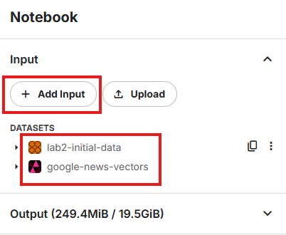
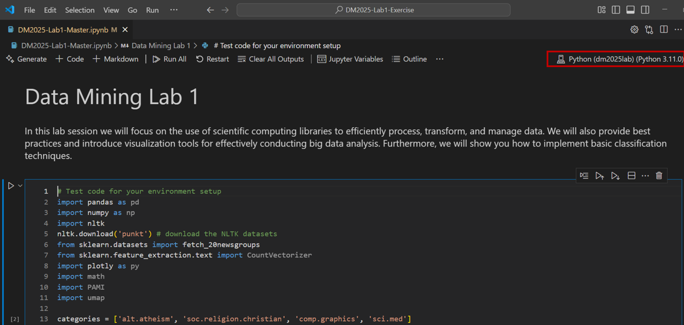
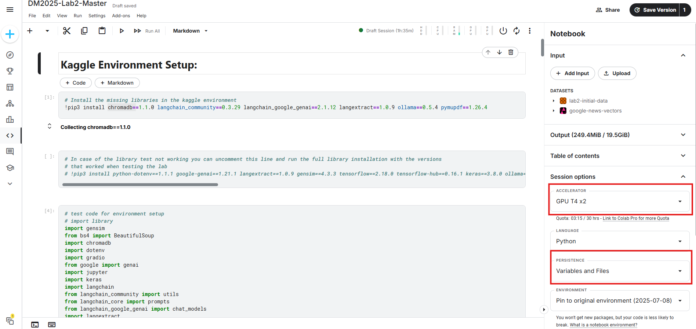
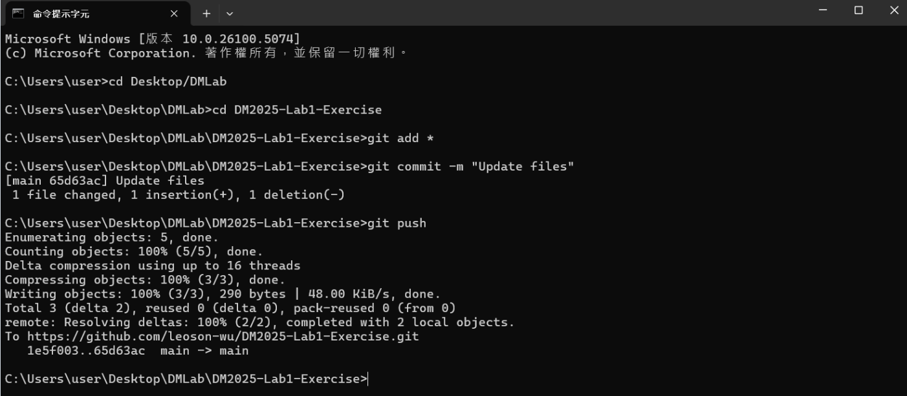

# [DM2025] Lab 2 – Environment Setup

Hi everyone,

This document provides detailed instructions for setting up the environment required for Lab 2. After finishing setting up the environment you will be ready to run Lab 2 Phase 1, to start Phase 2 please first check and follow `instructions/gemini_setup.pdf` so you can run the related notebook.

---

## System Requirements

Please make sure you have the following installed:

* **Python 3.11.0 (recommended)**
* **uv (Python virtual environment manager)**: [UV Tutorial Video](https://www.youtube.com/watch?v=6pttmsBSi8M&t=918s)
* **Git, GitHub account, *GitHub Desktop (optional)*:** [Tutorial Link for Git, GitHub & GitHub Desktop](https://www.youtube.com/watch?v=8Dd7KRpKeaE)
* **Jupyter Notebook**
* ***VS Code (optional)***
* **You need a Google account and Google's Gemini API Key:** [Get Your Gemini API Key in Google AI Studio (EASY Tutorial)](https://www.youtube.com/watch?v=RVGbLSVFtIk)
* ***Ollama for local LLM Models (optional):*** [Main website to download latest version](https://ollama.com/) | [Ollama Tutorial](https://www.youtube.com/watch?v=UtSSMs6ObqY&t=624s) | There is an extra notebook in this lab with part of our LLM exercises being solved locally with Ollama. For this 4 GB of VRAM are required (NVIDIA GPU), Kaggle or Google Colab can also be used with GPU activated.
---

## Setup Instructions

### 1. Install Python 3.11.0 (If you use your own version, take your own risk of dependency issues)

Download and install Python 3.11.0 (recommended):
https://www.python.org/downloads/release/python-3110/

During installation, check "**Add Python to PATH**".

Verify installation:

```bash
python --version
```
Expected output:
Python 3.11.0  

### 2. Create a GitHub Account and Install Git
#### Sign up for GitHub: https://github.com/  
#### Install Git:  
##### Windows: https://gitforwindows.org/  
##### Linux:

```bash
sudo apt install git-all
```
##### macOS:


```bash
brew install git
```
#### Verify installation:

```bash
git --version
```
Configure Git (replace with your GitHub username and email):
```bash
git config --global user.name "YOUR_USERNAME"
git config --global user.email "your_email@example.com"
```


---
### 3. Fork the Repository to your GitHub Account  
Go to: [DM Lab 2](https://github.com/difersalest/DM2025-Lab2-Exercise.git) in GitHub,  
Sign in to your GitHub account  
Click "Fork" to copy it into your own GitHub account.  


And it will redirect you to a "copy" of the repository in your own account. Once in your account (check that your name shows up at the top left corner), click the green button "Code", and the clipboard button beside the **link** that pops up. 

**Example from the previous lab:**


---
### 4. Create a Project Folder and Clone the Repository from your GitHub to your Project Directory   
Choose a location for your labs and create a directory:

Open a "Command Prompt" window in Windows or a "Terminal" window in macOS/Linux. Type the following commands, followed by the Enter key for each line: 

    cd \<yourpath\>

    mkdir DM2025Labs

    cd DM2025Labs

    git clone \<link you copied in the previous step\>
    
Replace \<yourpath\> by the path where you're going to store your documents. 
Below is an example, where I store my Lab in the "new" folder.

Replace \<link you copied in the previous step\> with the URL link to your own fork of the repository in your GitHub account (not the TAs one)  


---
### 5. Install uv
[UV Tutorial Video](https://www.youtube.com/watch?v=6pttmsBSi8M&t=918s)

In terminal or PowerShell:

```bash
pip3 install uv
uv --version
```
---
### 6. Create a Virtual Environment with uv
Navigate to the project folder: `DM2025-Lab2-Exercise` and create Virtual Environment  
The Virtual Environment must be created under the project folder: `DM2025-Lab2-Exercise`  
```bash
cd <your path to the DM2025-Lab2-Exercise>
uv venv
```

This creates a .venv folder inside the project.

---
### 7. Install the Dependent Libraries

Under project folder:  `DM2025-Lab2-Exercise`  

#### (Recommended) Install Libraries with the `uv sync` command 

```bash
uv sync
```
This will install all the libraries with the same version as the TAs' environment. 

If you encounter version dependency issues, please run the following command:

```bash
uv add python-dotenv google-genai langextract gensim tensorflow tensorflow-hub keras ollama langchain langchain_community langchain_core langchain-google-genai beautifulsoup4 chromadb gradio scikit-learn pandas numpy matplotlib plotly seaborn nltk umap-learn pymupdf
```

**You can also install extra libraries** if needed, like this:  
```bash
uv add <library_name>
```

#### (Alternative) Install Libraries with the `requirements.txt` file 
```bash
uv add -r requirements.txt
```
This installs all required Python packages specified in the `requirements.txt` file with the specified versions tested by the TAs, everything needed to run our lab.   


#### (Alternative) Using Pip and manual venv with VS Code
We suggest to use `uv` but in case you want to use `pip` you can also make the virtual environment manually, like in this tutorial: [How To Setup A Virtual Environment For Python In Visual Studio Code](https://www.youtube.com/watch?v=GZbeL5AcTgw)
After you follow the tutorial you should be able to install everything like this once inside the `venv` in the lab directory:

```bash
pip3 install -r requirements.txt
```

#### (Alternative) If you are using Google Colab   

**`The link to a Google Colab Notebook already tested is shared in section: 10. Run Notebook`**.

Copy the notebook shared to your account and run the cells.

After installing the libraries, in the output you might see a `warning`.

**You need to restart the runtime in order to use newly installed library versions.** 

Press the **"`RESTART RUNTIME`"** button. 

#### (Alternative) If you are using Kaggle

**`The link to a Kaggle Notebook already tested is shared in section: 10. Run Notebook`**.

Copy said notebook shared to your account and run the cells.

Inside said notebook in `Kaggle` the dependencies versions changed in order to work in their container.

Most of the dependencies are already installed.


In Kaggle remember to have these `Datasets` added into your notebook:

[Lab 2 necessary data from the GitHub Repository](https://www.kaggle.com/datasets/didiersalazar/lab2-initial-data)

(Explained in the next section)
[Google News Vectors](https://www.kaggle.com/datasets/didiersalazar/google-news-vectors)




`Note: In Kaggle/Colab, Python version may differ (e.g., 3.10). Some packages could behave differently.`

---

### 8. Download a pre-trained Word2Vec model
If you are using a Jupyter Notebook or Google Colab, you can download the Google News Vector:
[Google word2vec](https://code.google.com/archive/p/word2vec/)


If you are using Kaggle Kernel, you can add this dataset to your notebook: [Kaggle | Google word2vec](https://www.kaggle.com/datasets/didiersalazar/google-news-vectors)

Copy the file into the `GoogleNews` folder of this lab and unzip it to have the `.bin` format (~3.5 GB).

---

### 9. Register Jupyter Kernel
Under project folder:  `DM2025-Lab2-Exercise`  
```bash
uv run python -m ipykernel install --user --name=dm2025lab --display-name "Python (dm2025lab)"
```

---
### 10. Run Notebook  
#### Run in VS Code
[Tutorial | Jupyter Notebook in VS Code](https://www.youtube.com/watch?v=suAkMeWJ1yE)

If using VS Code:

Open your terminal/PowerShell  
```bash
cd <your path to the DM2025-Lab2-Exercise>
code
```
Open the `DM2025-Lab2-Master-Phase_1.ipynb`  

Then select "Python (dm2025lab)" as the kernel in the top-right corner.  
  


#### (Alternative) Run Jupyter Notebook in Browser  
Start Jupyter:

```bash
cd <your path to the DM2025-Lab2-Exercise>
uv run jupyter notebook
```


If error occurs:

```bash
python -m notebook
```  
A browser window will open.  
Open the `DM2025-Lab2-Master-Phase_1.ipynb` 

In the same way as in Lab 1, select **Python (dm2025lab)** as the notebook kernel on the top-right corner.  


#### (Alternative) Run in Kaggle
If you cannot set up Python locally:  
Create an account: https://www.kaggle.com/  
Copy our tested Kaggle Master Notebooks for Lab 2:
1. [DM2025-Lab2-Master-Phase_1.ipynb | Kaggle](https://www.kaggle.com/code/didiersalazar/dm2025-lab2-master-phase-1)
2. [DM2025-Lab2-Master-Phase_2_Main.ipynb | Kaggle](https://www.kaggle.com/code/didiersalazar/dm2025-lab2-master-phase-2-main)
3. [DM2025-Lab2-Master-Phase_2_Bonus.ipynb | Kaggle](https://www.kaggle.com/code/didiersalazar/dm2025-lab2-master-phase-2-bonus)

It should look like this after you copy it: 



Like shown in the image above, you need to run Kaggle with `T4 GPUs`, and also select `Persistence of Variables and Files` so your data does not get reset everytime you restart a session.

#### (Alternative) Run in Google Colab
With your google account enter colab:  
Create an account: https://colab.research.google.com/  

We provide links where you can copy our notebooks:
1. `DM2025-Lab2-Master-Phase_1.ipynb` ready to run in colab: [Lab 2 Master Phase 1 Notebook in Google Colab](https://colab.research.google.com/drive/1fLTAI9DHEvDX9cztwyzkMb2SPjaTJNhB?usp=sharing)
2. `DM2025-Lab2-Master-Phase_2_Main.ipynb` ready to run in colab: [Lab 2 Master Phase 2 Main Notebook in Google Colab](https://colab.research.google.com/drive/1-zAGHQUuHpis06X6NkbiFWj44mTgAg9k?usp=sharing)
3. `DM2025-Lab2-Master-Phase_2_Bonus.ipynb` ready to run in colab: [Lab 2 Master Phase 2 Bonus Notebook in Google Colab](https://colab.research.google.com/drive/11LluSCrbJQNi7DGcWiZV9BW9C8QPHjXd?usp=sharing)

Run Google Colab with `T4 GPU`, follow these steps:


Run the setup cells first in the beginning of the notebook. The environment was tested beforehand and you should be able to run successfully all the material. If there is any problem please contact the TAs.

Just remember that google colab does not save any new data directly, every time you open the session you will need to run the cells in the beginning to get the initial data/material.

So, if you would like to save your outputs you can connect colab to your drive in this way:
```python
from google.colab import drive
drive.mount('/content/gdrive')
```
Run the code and authenticate your account, after that you can change the directories inside the notebook to your folder in google drive to save any outputs/results from the lab if you would like to have them. 

If you are interested you can check the following tutorial: [How to Read Dataset in Google Colab from Google Drive](https://www.youtube.com/watch?v=Gvwuyx_F-28)

---
### 11. Test Your Environment
Open the `DM2025-Lab2-Master-Phase_1.ipynb`

Paste the script below into a notebook cell and run it:

```python
# test code for environment setup
# import library
import dotenv
from google import genai
import langextract
import gensim
import tensorflow
import tensorflow_hub
import keras
import ollama
import langchain
from langchain_community import utils
from langchain_core import prompts
from langchain_google_genai import chat_models
from bs4 import BeautifulSoup
import chromadb
import gradio
import jupyter
import sklearn
import pandas
import numpy
import matplotlib
import plotly
import seaborn
import nltk
import umap
import pymupdf

%matplotlib inline

print("gensim: " + gensim.__version__)
print("tensorflow: " + tensorflow.__version__)
print("keras: " + keras.__version__)
```


If no errors occur, your environment is ready.

---

# Troubleshooting
Ask classmates or TAs for help before the lab if you encounter installation issues.  
If you prefer a GUI for Git, use GitHub Desktop: https://desktop.github.com/  
Good luck with the setup and see you on Monday, Oct 20th!  

---
# If everything is OK, you can start to do Lab 2 Phase 1...
---

# Save your Progress by Push 
Remember to save your notebooks. You will also have to "Push" the changes you've made in your computer to the internet. To do this, open a "Command Prompt" window in Windows or a "Terminal" window in macOS/Linux. Type the following commands followed by the Enter key: 

    cd <your path to the DM2025-Lab2-Exercise>
    git add .
    git commit -m "yourmessage"
    git push 
    
You can replace "yourmessage" with something like "Finished Ex1 and Ex2. Added graph for Ex. 6" . You can save and commit as often as you like. Below is an example:



You also have the option to use GitHub Desktop, if anything happens check the tutorial: [Tutorial Link for Git, GitHub & GitHub Desktop](https://www.youtube.com/watch?v=8Dd7KRpKeaE)

# Submission Guidelines and Deadlines

Check the `DM2025-Lab2-Homework.ipynb` file for all the details.

Make sure to commit and push your changes to your GitHub repository __BEFORE the deadline for each phase to have 100% of the grade to be considered__. Phase 1 and 2 refer to the parts where you solve the exercises in the provided notebooks, and Phase 3 refers to our Kaggle's in-class competition.

Make sure your repository must contain 4 notebooks, including: 
1. `DM2025-Lab2-Master-Phase_1.ipynb` from [DM Lab 2 Master Phase 1](https://github.com/difersalest/DM2025-Lab2-Exercise/blob/main/DM2025-Lab2-Master-Phase_1.ipynb)
2. `DM2025-Lab2-Master-Phase_2_Main.ipynb` from [DM Lab 2 Master Phase 2 Main](https://github.com/difersalest/DM2025-Lab2-Exercise/blob/main/DM2025-Lab2-Master-Phase_2_Main.ipynb)
3. `DM2025-Lab2-Master-Phase_2_Bonus.ipynb` from [DM Lab 2 Master Phase 2 Bonus](https://github.com/difersalest/DM2025-Lab2-Exercise/blob/main/DM2025-Lab2-Master-Phase_2_Bonus.ipynb)
4. `DM2025-Lab2-Homework.ipynb` from [DM Lab 2 Homework](https://github.com/difersalest/DM2025-Lab2-Exercise/blob/main/DM2025-Lab2-Homework.ipynb)

This lab has 3 phases/parts and one optional notebook, these are some recommendations when running the lab:
- **Phase 1 exercises:** Need GPU for training the models explained in that part, if you don't have a GPU in your laptop it is recommended to run in Colab or Kaggle for a faster experience, although with CPU they can still be solved but with a slower execution.
- **Phase 2 exercises:** We use Gemini's API so everything can be run with only CPU without a problem.
- **Phase 3 exercises:** For the competition you will probably need GPU to train your models, so it is recommended to use Colab or Kaggle if you don't have a laptop with a dedicated GPU.
- **Optional Ollama Notebook (not graded):** You need GPU, at least 4GB of VRAM with 16 GB of RAM to run the local open-source LLM models. 


When you're done (or at any moment), find your repository link. Open the assignment page on our [NTU COOL platform](https://cool.ntu.edu.tw/login/portal). Make a submission by pasting the link to your git repository to **Lab 2 section**, we will have an assignment ready for each phase there.  


You can find your repository link by logging into [Github](https://github.com/), clicking on your profile icon on the upper right corner, selecting "Your repositories", and clicking on the name of your repository. Then copy the link in your browser.  

Again, __we will not consider pushes made after the deadline with a 100% of the total grade, it will be considered a late submission and subjected to a formula__. The formula will be shared via an additional announcement. 

That's it! We wish you Good luck!


